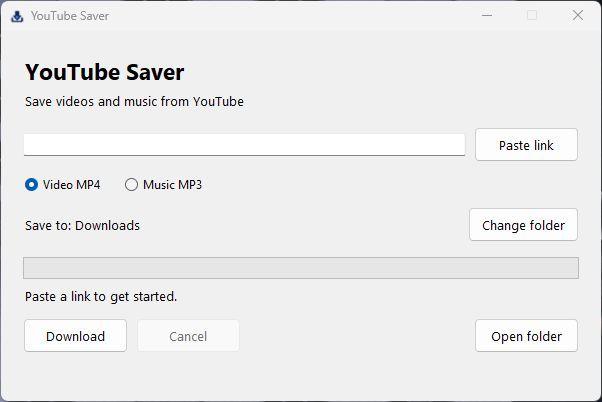
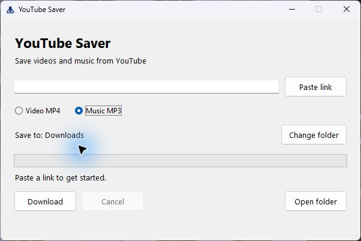

# YouTube Saver

A minimal Windows app for saving YouTube videos and music.



1. Paste a YouTube video link.
2. Choose **Video MP4** or **Music MP3**.
3. Click **Download**. Files go to your Windows Downloads folder.



Video uses the best available streams without a resolution cap. MP3 uses the
best audio source. The native Windows window has a fixed size.

No account, ads, extensions, telemetry, or background update checks. Internet
is needed for YouTube. Restricted videos may fail; modern MP4 codecs may need
a compatible player. Download only content you own or have permission to save.

## Run or build

Windows 10/11 x64. Release builds include Python and all required tools.
For source development, install Python 3.12+ with Tk, then:

```powershell
python -m venv .buildenv
.buildenv\Scripts\python -m pip install -r requirements-build.txt
.buildenv\Scripts\python scripts\fetch_tools.py
.buildenv\Scripts\python run.py
.buildenv\Scripts\python -m unittest discover -s tests
.buildenv\Scripts\python scripts\build.py --iscc "path\to\ISCC.exe"
```

The installer and portable EXE, checksums and release notes go in
**`release-local/`**, which is ignored by Git. Nothing is published automatically.
The local ready-to-run copy is in **`app/`**; its binaries and any previous
downloads are also ignored by Git. The installer uses the project's own logo.
See the [installer preview](docs/screenshots/installer.png).
Before committing, run `.buildenv\Scripts\python scripts\audit_release.py --staged` to check the
exact staged files for private paths, secrets, unexpected binaries and image metadata.

Application code: [MIT](LICENSE). Bundled components have [separate licenses](THIRD-PARTY-NOTICES.md).
Not affiliated with YouTube.
